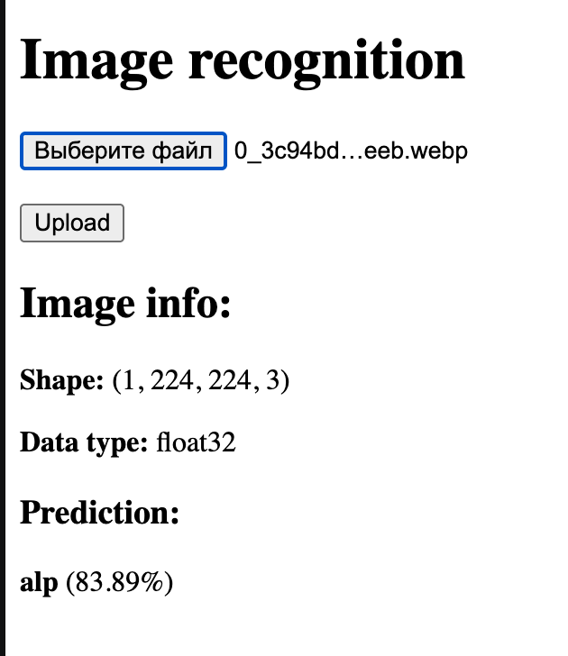
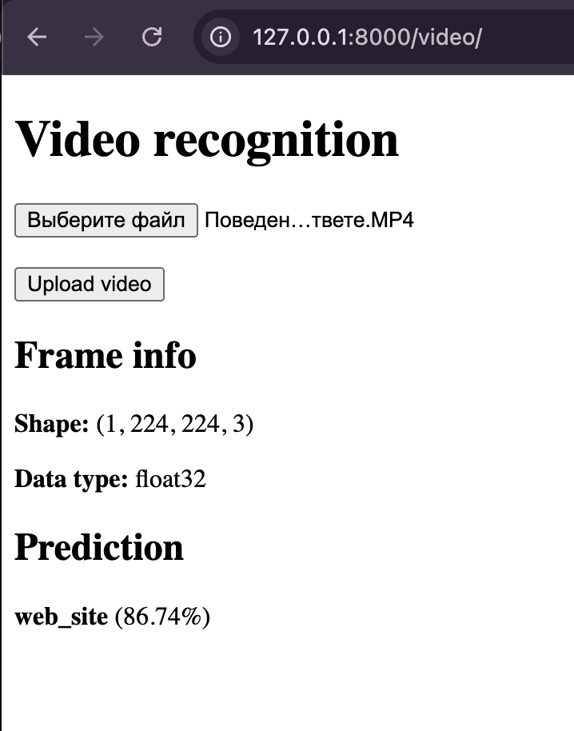
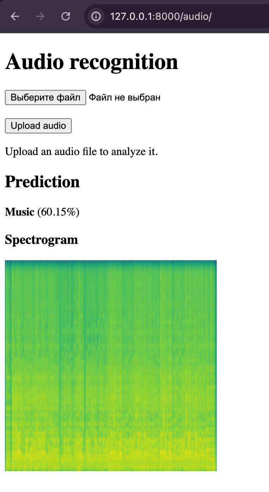

# Python Django Project з інтеграцією TensorFlow

## Загальна інформація
Даний репозиторій містить навчальний проєкт, розроблений у межах лабораторної роботи з інтеграції фреймворку **Django** та бібліотек **TensorFlow / Keras**.

Проєкт складається з двох основних частин:
1. Проходження офіційного Django tutorial.  
2. Реалізація вебзастосунків з використанням методів штучного інтелекту.

---

## Частина 1. Django Tutorial
У першій частині було повністю пройдено офіційний туторіал  
**"Writing your first Django app" (частини 1–8)**.

У межах туторіалу реалізовано:
- створення Django-проєкту та застосунку `polls`
- роботу з моделями та міграціями
- використання Django Admin
- шаблони (templates)
- статичні файли
- автоматичні тести
- підключення Django Debug Toolbar

Усі етапи виконання зафіксовані відповідними комітами в історії репозиторію.

---

## Частина 2. Вебзастосунки з ШІ

### Пункт 1. Розпізнавання зображень
Реалізовано Django-застосунок **`image_recognition`**, який дозволяє:
- завантажувати зображення через веб-інтерфейс
- виконувати попередню обробку зображень (RGB, resize 224×224)
- використовувати згорткову нейронну мережу **MobileNetV2 (ImageNet)**
- отримувати прогнозований клас об’єкта та відсоток впевненості

**Демо (скриншот):**  

**Використані технології:**
- Django 4.x  
- TensorFlow 2.x  
- Keras  
- MobileNetV2  
- NumPy  
- Pillow (PIL)

---

### Пункт 2. Розпізнавання елементів у відео
Реалізовано Django-застосунок **`video_recognition`**, який забезпечує:
- завантаження відеофайлів через веб-інтерфейс
- обробку відео з використанням **OpenCV**
- виділення окремих кадрів із відео
- попередню обробку кадрів для нейромережі
- класифікацію кадрів за допомогою **MobileNetV2**
- відображення результатів розпізнавання та рівня впевненості

**Демо (скриншот):**  

**Використані технології:**
- Django  
- OpenCV (cv2)  
- TensorFlow / Keras  
- MobileNetV2  
- NumPy  

---

### Пункт 3. Розпізнавання звуку
Реалізовано Django-застосунок **`audio_recognition`**, який дозволяє:
- завантажувати аудіофайли через веб-інтерфейс
- виконувати попередню обробку аудіосигналів
- використовувати модель **YAMNet (Google Audio Model)**
- визначати тип звуку (мова, музика, шум, тварини тощо)
- відображати прогноз та рівень впевненості

**Демо (скриншот):**  

**Використані технології:**
- Django  
- TensorFlow  
- YAMNet  
- Librosa  
- NumPy  

---

### Пункт 4. Візуалізація аудіо через спектрограми
Реалізовано механізм збереження та відображення спектрограм:
- аудіофайл перетворюється у спектрограму
- спектрограма зберігається у папці `media/spectrograms`
- результат відображається у веб-інтерфейсі після аналізу

Це дозволяє наочно аналізувати звукові сигнали у часово-частотному просторі.

> Примітка: спектрограма показується на сторінці `audio_recognition` після завантаження файлу.

**Використані технології (додатково до пункту 3):**
- Matplotlib  

---

### Пункт 5. Розпізнавання емоцій за фотографією
Реалізовано Django-застосунок **`emotion_recognition`**, який дозволяє:
- завантажувати фотографії облич через веб-інтерфейс
- виконувати попередню обробку зображень (grayscale, resize 64×64)
- використовувати модель для класифікації емоцій
- визначати емоційний стан людини (happy, sad, angry, neutral тощо)
- відображати результат класифікації та рівень впевненості

**Демо (скриншот):**  

**Використані технології:**
- Django  
- TensorFlow / Keras  
- Convolutional Neural Network (CNN)  
- NumPy  
- Pillow (PIL)  

---

## Структура проєкту
- `djangotutorial/` — основний Django-проєкт  
- `polls/` — застосунок з офіційного tutorial  
- `image_recognition/` — розпізнавання зображень  
- `video_recognition/` — розпізнавання відео  
- `audio_recognition/` — розпізнавання звуку та спектрограми  
- `emotion_recognition/` — розпізнавання емоцій за фотографіями  
- `templates/` — HTML-шаблони  
- `media/` — збережені медіафайли (аудіо, зображення, спектрограми)  
- `static/` — статичні файли  
- `screenshots/` — скриншоти демонстрації роботи
